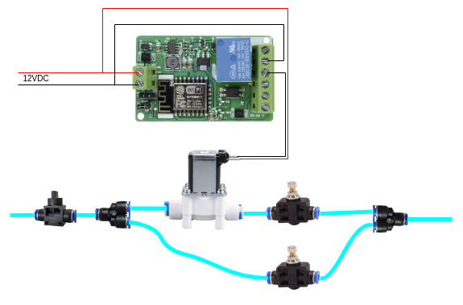

# laser_engraver_coolant_switcher

The air coolant is commonly used in laser engraving and cutting to get higher quality.
Normaly you should use LOW air flow during engraving to keep the smoke away of laser lens and HIGH air flow during cutting to have clean cut edges.
This project should help to control coolant supply for a grbl-based laser engraver.

## Description
The coolant switcher consists of two parts: 
- python script, that communicates with Lightburn and detects Coolant ON/OFF Gcode commands
- ESP8266 board, that switches coolant ON/OFF 

The dependency between air flow and Gcode commands is the following:

|Air flow|Gcode command|   Meaning   |
|:------:|:-----------:|:-----------:|
|   ON   |     M8      | Coolant on  |
|   OFF  |     M9      | Coolant off |

## Prerequisites
- Grbl-based laser engraver (for example Ortur Laser Master 3 LE)
- Lightburn software
- WiFi access point
- Aircompressor for air supply
- python3 is installed on your OS

## Used hardware
- ESP8266 relay board
- 12VDC pneumatic solenoid valve
- 2pcs of pneumatic throttle valve
- 12VDC power supply

## Piping and wiring

## How to use
- Start you WiFi access point (smartphone can be used)
- Use your SSID and PASS in `include/project_config.h`
- Build and download ESP8266 FW, power on
- Get the ESP8266 IP address from your WiFi AP. Use the IP in `coolanter/coolanter.py`: `SWITCHER_IP`
- Connect your laser engraver to WiFi AP. Use its IP in `coolanter/coolanter.py`: `ENGRAVER_IP`
- Start `coolanter/coolanter.py`
- Start Lightburn. Add new grbl device with localhost address (127.0.0.1)
- Enjoy!